# Ambulance Response Time Prediction Analysis using R
# By: Natasha Sharma

### Task Description: 
As an analyst we are supposed to predict the time taken for an Ambulance to respond to a call based on the data provided. We will have to use one of the Machine Learning algorithms to complete this task. We will also have to analyze the data to figure out what factors will affect the response time and how those factors can be used in our ML algorithm.

### Data Generating Process / Bias Template

Before we get to working with the data and building a predictive model, we will provide an assessment of what we, the model builder, perceive to be the data generating process for your data sources and potential sources of bias that could result from either the data or the model building process.

### Data Generating Process

As a data analyst, we will be working with data that we didn’t have a hand in originally collecting, and we may not fully understand. This is common in many practices as a data analyst, and we have to build a healthy skepticism of any dataset you work with, even if we created it yourself. Before we can build our predictive model, we have to first understand how the data was generated, and what potential sources of bias might be present that could skew our results. 

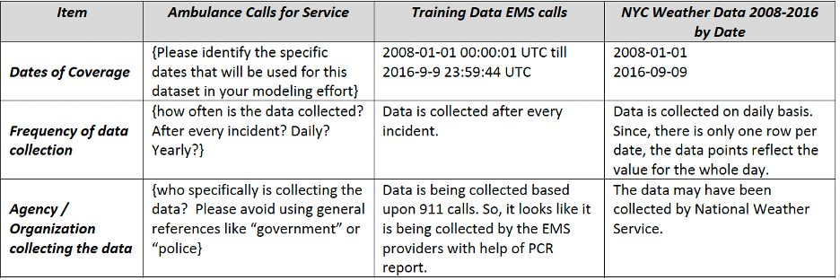
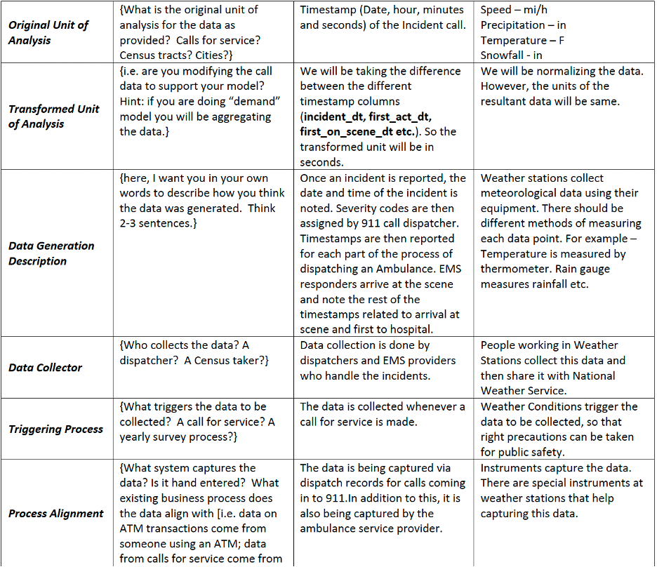

### Potential Sources of Bias

In this project, we are using ambulance calls for service data from New York City during the years 2008-2016 to build your models. While the data is administratively collected from Computer-Aided Dispatch records, it doesn’t mean that it is free from differences in data scope or collection that could bias its results from one or more subgroups. In addition, any additional datasets we plan on bringing in also suffer from potential biases that need to be acknowledged at the outset.

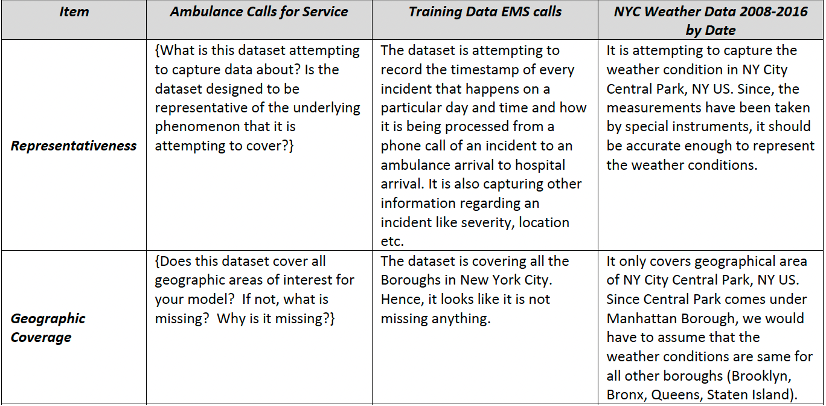 
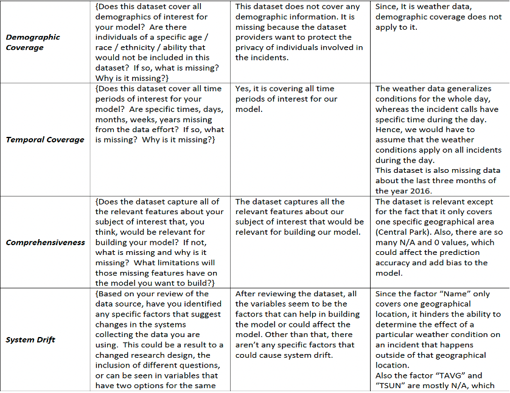 
 

### Descriptive Analysis

Part 1 – EMS Calls for Service Data 

In this section, we will first analyze our calls for service data. We will be providing descriptive tables and charts of the individual calls for service data, so no transformation is needed yet. 

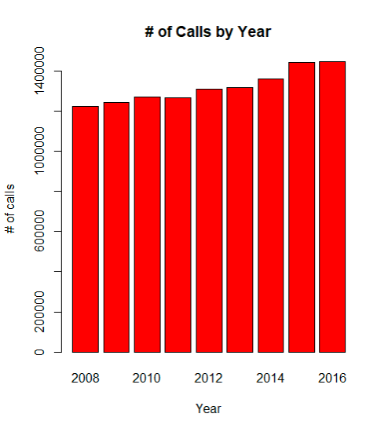

The bar graph of Number of Calls by year shows a trend of increasing the calls every year as we go from 2008 to 2016. The one unusual pattern is that the number of calls is increasing from 2008 to 2010, but there is a slight decrement of calls in 2011. However, the trend is continuing with the increase in the number of calls from 2012 to 2016. Also, there is a much significant increase from 2014 to 2016 when compared to the previous years.

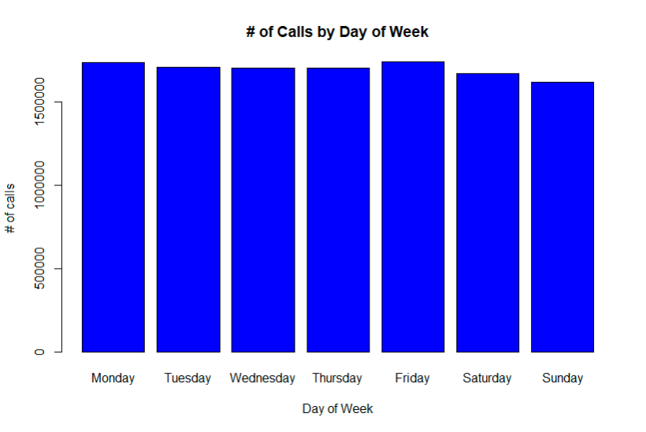

The above bar chart representing the number of calls by Day of Week shows that the Number of calls received on Friday are the highest, following by Monday. The graph above also shows that the number of calls on weekends is lowest when compared to other days of the week, especially on Sunday.

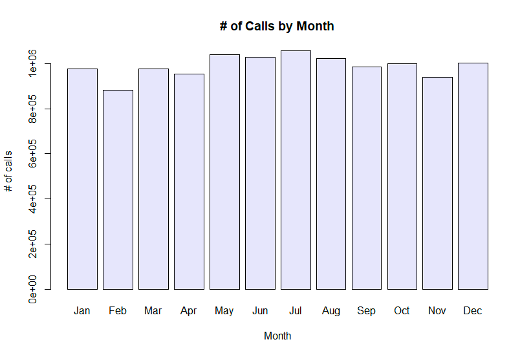 
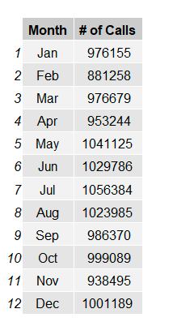

The above bar chart representing the number of calls by Month shows that the Number of calls received in the Month of July are the highest, following by May then June and then December. The graph above also shows that the number of calls in February is lowest when compared to other months and the pattern of number of calls by month is not consistent.

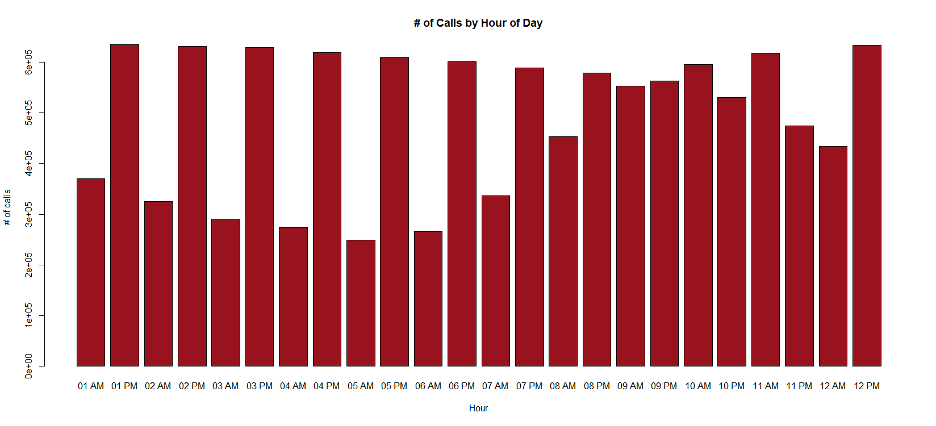

The above bar chart representing the number of calls by Hour of the Day shows that the Number of calls received at 12pm and 1 pm are the highest, followed by 2 pm and 3 pm. The graph above also shows that the number of calls at 5 am is lowest when compared to other hours of the day. The overall graph shows that the number of calls after midnight at 1 pm till the morning at 7 am are comparatively lower than the number of calls received during the daytime from 8 am in the morning till 12 pm in the midnight.

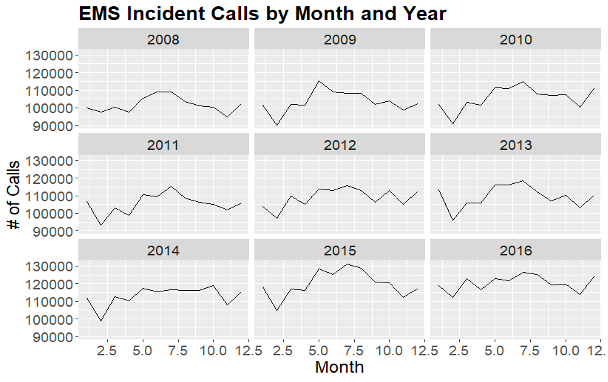

The above graph shows the number of calls by month and year. We can see the highest number of calls in the year 2015 in the months April to July. The year 2008 has the lowest call volume among all the years. The peak call volumes are always around the months of June, July and August, apart from the year 2014, where the peak call volume was around the month October.

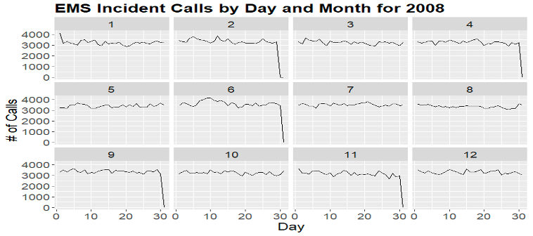

The highest peak in the year 2008 is around 8-9 June. January 2008 also started with a very high number of calls.

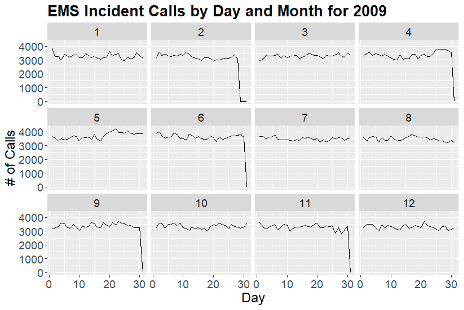

The highest peak in the year 2009 is around 23-24 May. In general the months of May and June have more calls than other months in this year.

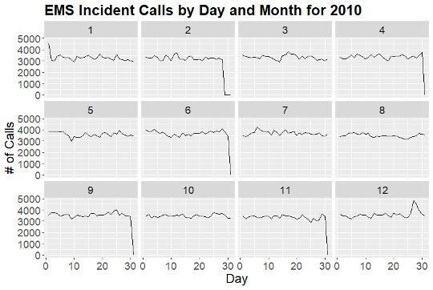

In the Year 2010 January had an abnormally high volume of calls on the 1st day while the number of calls dropped drastically on the subsequent days. We see the highest peak in the next couple of days after Christmas around 26-27 December.

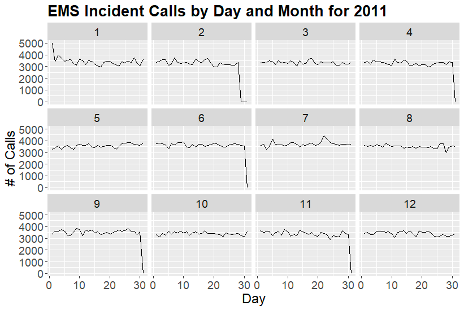

The Year 2011 follows the same pattern as 2010 with a very high call volume on 1st January. But the number of calls around 5000 are higher than compared to 2010 which was around 4000. The calls then dropped in the next couple of days. In 2011 the highest call volume was seen on 1st January.

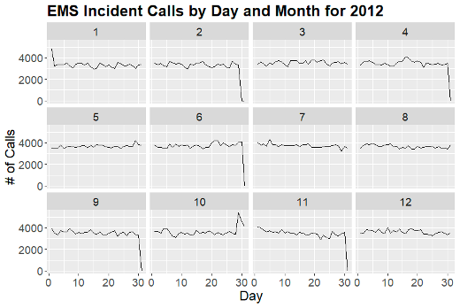

Again in 2012 there was a significant peak on 1st Januray which is a pattern seen in all the years possibly due to New Year’s traffic and weather. But there is a significant peak around 29th October in 2012.

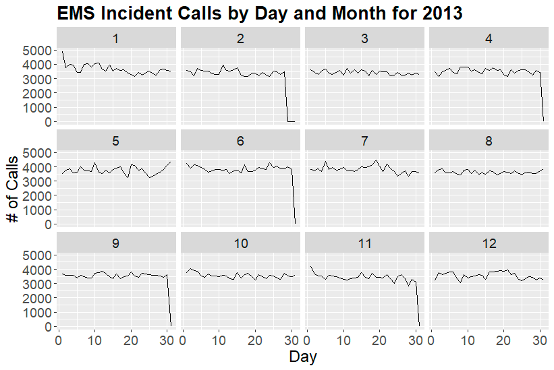

Following the same pattern as last years there is a peak on 1st January 2013 with call volume dropping after.

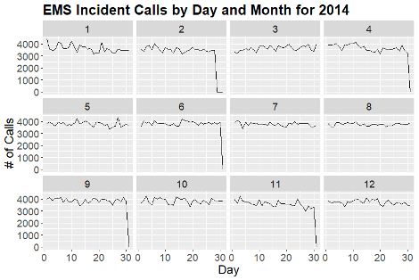

January 2014 had much more call volume throughout the month when compared to other years. 1st January also saw the peak volume of call on any single day in 2014.

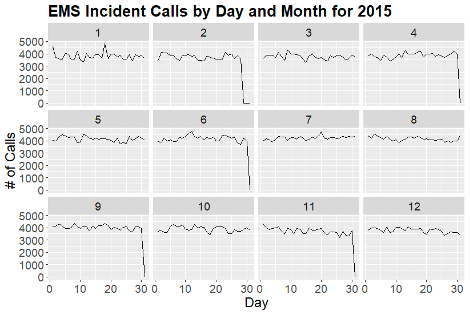

The highest call volume in the year 2015 was around 18th January.

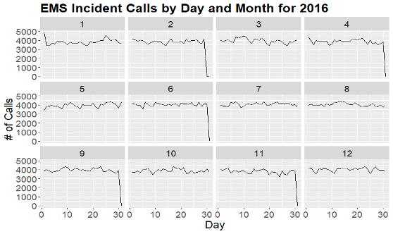

2016 follows the same pattern as every other year with a very high call volume on 1st January and calls dropping after that. The rest of the months of this year show approximately the same pattern.

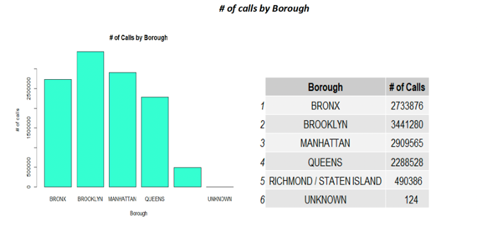

The above graph and table show that the Borough” Brooklyn” receives the greatest number of calls with 3441280, followed by Manhattan with 2909565 number of calls. There is no doubt that these two Boroughs of New York City are the most popular and crowded, which makes them the more accident-prone areas. Staten Island has the least number of calls with 490386. The unusual thing about the above chart is that there is one unknown borough, which shows the number of calls received as 124, which is the least number compared to all other boroughs. This unknown borough is also acting as an outlier in the above graph.

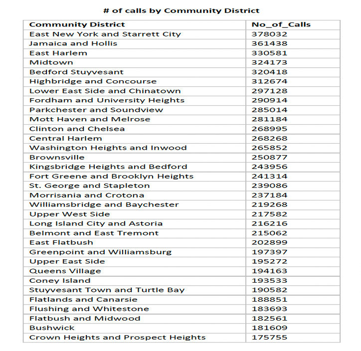
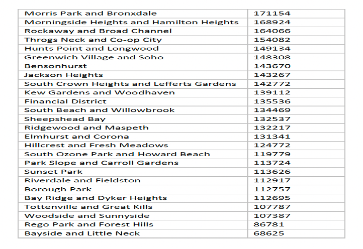

After looking at the above table representing the number of calls by Community District, it shows that the Number of calls received in the East New York and Starrett City district are the highest with 378032. Followed by Jamaica and Hollis with 361438 number of calls. The lowest number of calls 68625 was received by Bayside and Little Neck district. The high number of calls in East New York and Starrett City will affect the incident response time negatively.

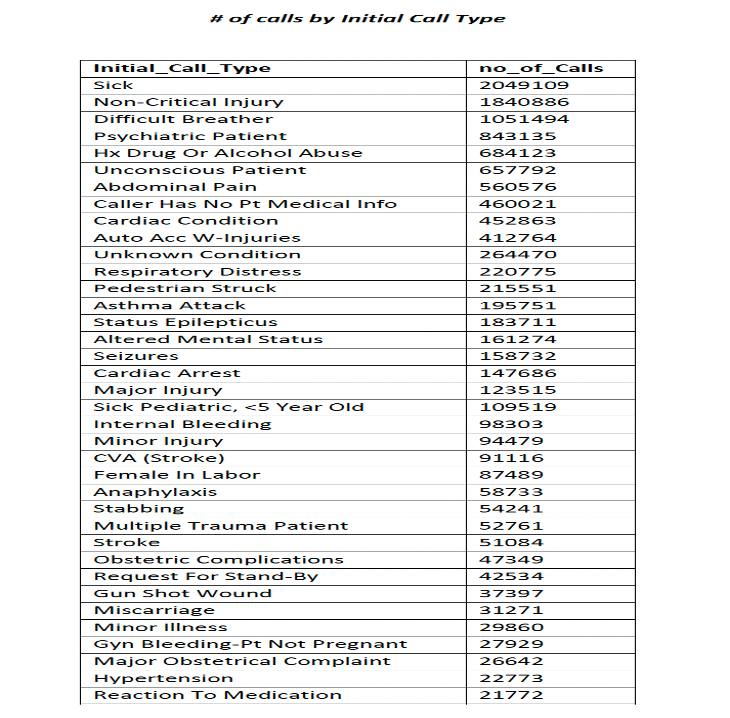
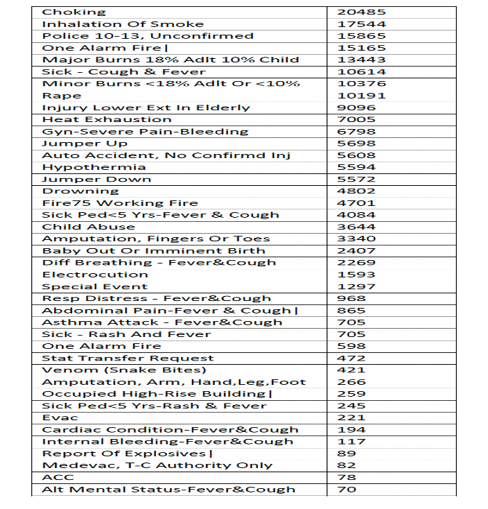
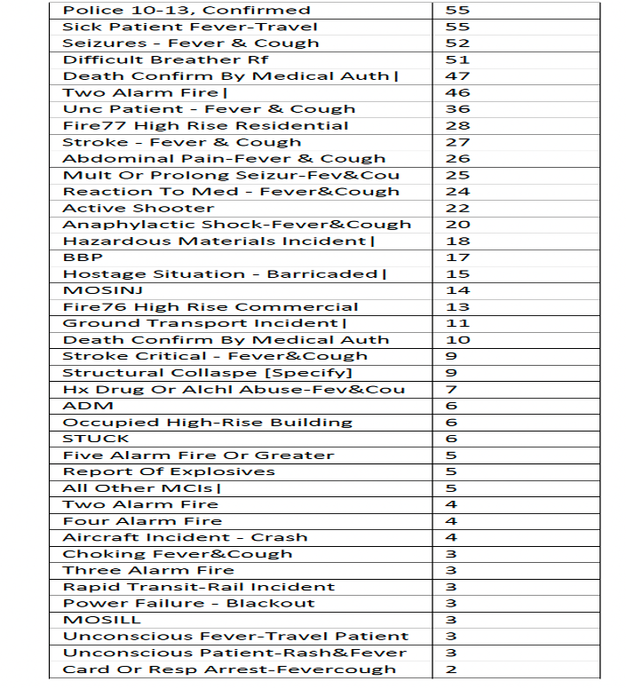
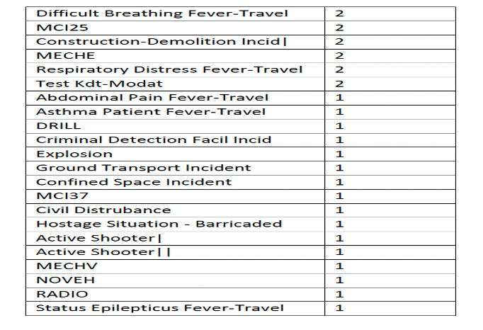

The above table shows that the initial call type “Sick” has the highest value of 2049109, which means many people call because of sickness. Followed by “Non-Critical Injury "with 1840886 number of calls, then “Difficult Breather”, with 1051494 number of calls and then “Psychiatric Patient” with 843135 number of calls. There are some initial call types that EMS receives the lowest calls for like Seizures - Fever & Cough, Active Shooter

Power Failure – Blackout, MCI25, Abdominal Pain Fever-Travel etc.

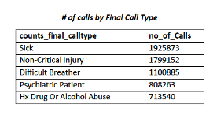
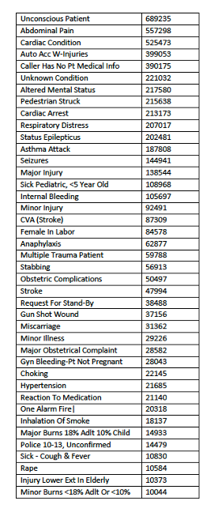
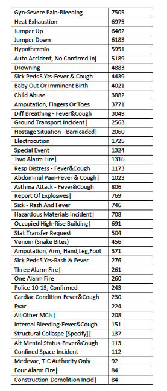
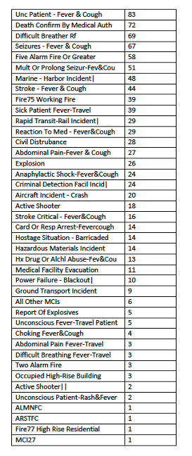
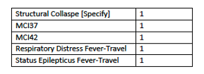

After looking at the above table representing the number of calls by Final Call Type, it shows that it follows the same pattern as the number of calls by initial call type with highest number of calls for sickness, Non-Critical Injury, Difficult Breather, Psychiatric Patient etc. However, there are some differences in the number of calls for each type.

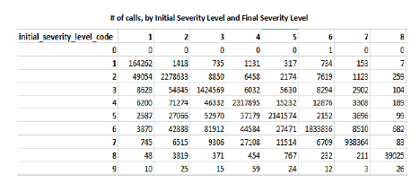

After looking at the above table representing number of calls, by Initial Severity Level and Final Severity Level, it shows that the severity code from 1 to 7 has the highest number of calls. Whereas the severity code 8 and 9 has significantly a smaller number of calls, which indicates the there are a smaller number of calls with high severity code. Most of the calls of 9 Initial severity are reduced to 5 or less as depicted in the last row of the table. However, we see that most of the calls with 8 Initial Severity level are also assigned 8 Final severity.

Part 2 – Response Time Analysis

1. Distribution of calls by length of incident_response_seconds_qy

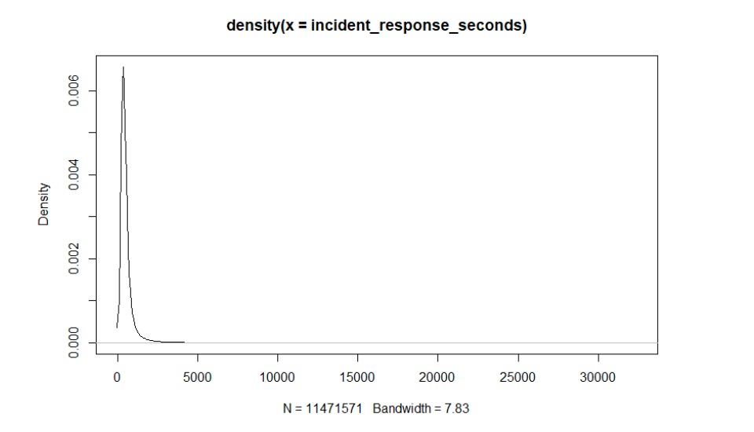

Upon inspection of the density plot of the incident_response_seconds_qy column, we can see that most of the
values lie between 0 to 2000 seconds. So, to get a clearer picture, we can remove all rows where
incident_response_seconds_qy > 2000.

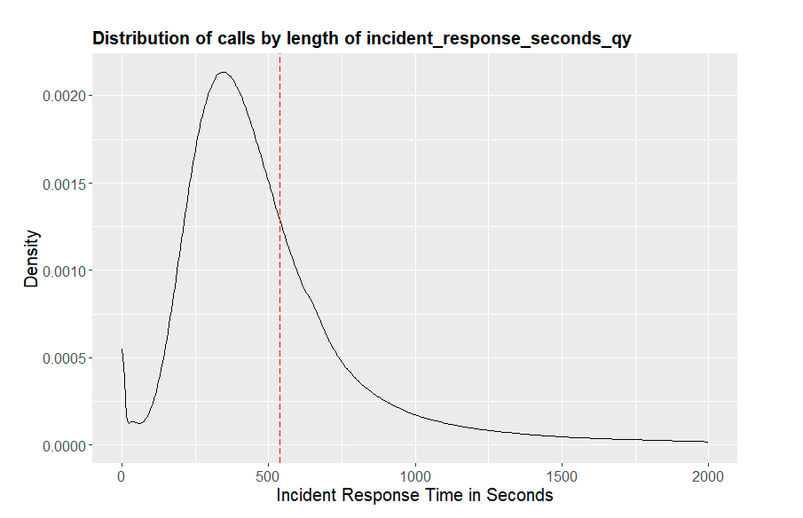

The above density curve shows the Distribution of calls by length of incident_response_seconds_qy. We can see
that the curve is highly left skewed with the mean value of approximately 536, which means the mean is less
than the median for this curve.
Also, the curve is unimodal, which means it only has one peak, and the highest peak is shown at approximately
375 seconds. We can say that most of the incident response time values lie in the range of approximately 250 to
500 seconds.

2. Distribution of calls by length of dispatch_response_seconds_qy

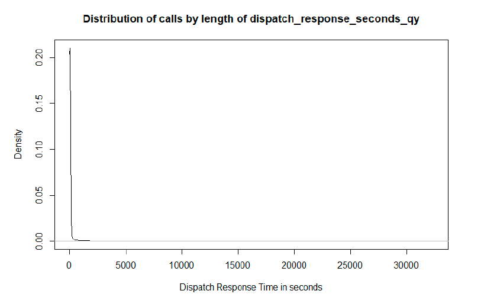

Upon inspection of the density plot of the dispatch_response_seconds_qy column, we can see that most of the
values lie between 0 to less than 150 seconds. So in order to get a clearer picture, we can remove all rows where
dispatch_response_seconds_qy > 150.

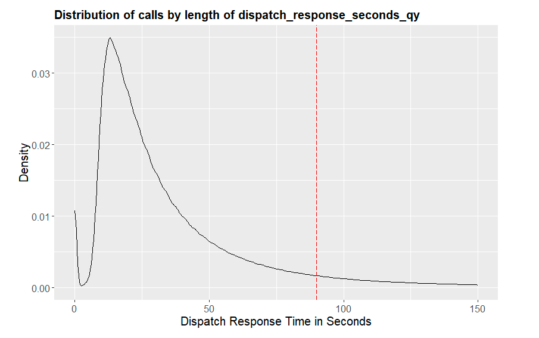

The above density curve shows the Distribution of calls by length of dispatch_response_seconds_qy. We can see
that the curve is highly left skewed with the mean value of approximately 90, which means the mean is less than
the median for this curve.

Also, the curve is unimodal, which means it only has one peak, and the highest peak is shown at approximately
13 seconds. We can say that most of the dispatch response time values lie in the range of approximately 5 to 50
seconds.

3. Distribution of calls by length of incident_travel_tm_seconds_qy

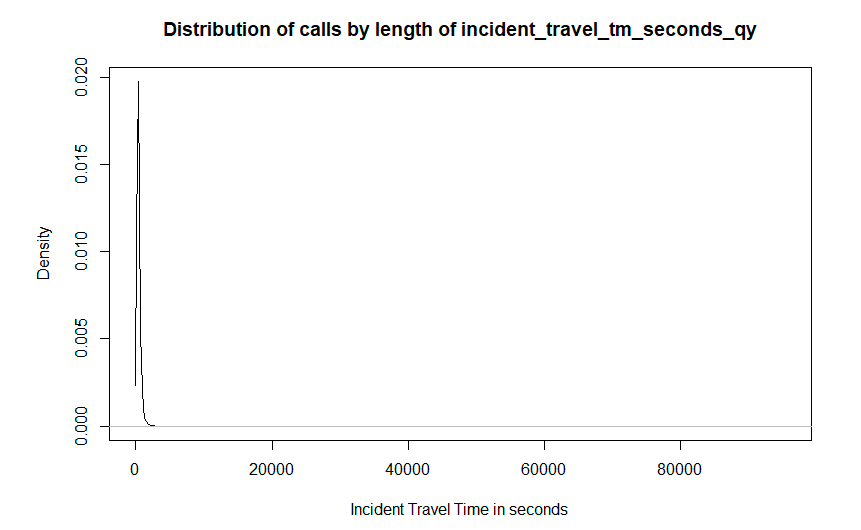

Upon inspection of the density plot of the incident_travel_tm_seconds_qy column, we can see that most of the
values lie between 0 to less than 2000 seconds. So, to get a clearer picture, we can remove all rows where
incident_travel_tm_seconds_qy > 2000.

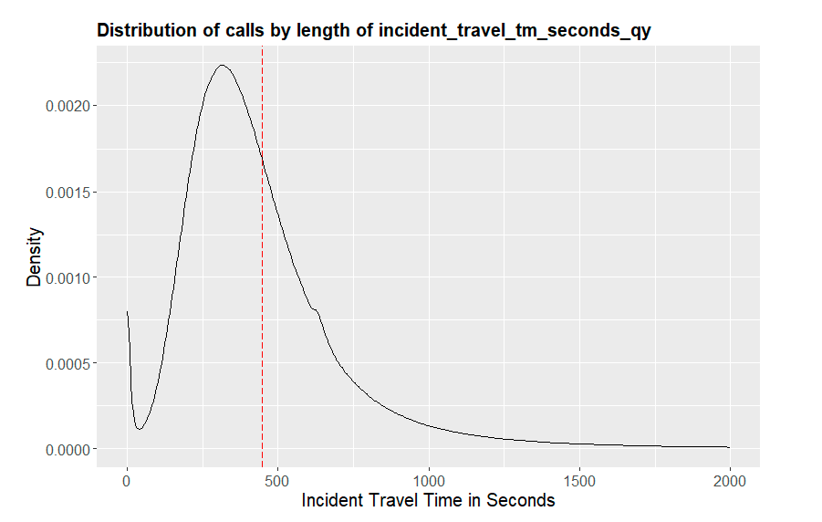

The above density curve shows the Distribution of calls by length of incident_travel_tm_seconds_qy. We can see
that the curve is highly left skewed with the mean value of approximately 448, which means the mean is less
than the median for this curve.

Also, the curve is unimodal, which means it only has one peak, and the highest peak is shown at approximately
325 seconds. We can say that most of the dispatch response time values lie in the range of approximately 100 to
750 seconds.

4. Distribution of calls by length of incident_response_seconds_qy, for each Borough (i.e. five separate
distributions)

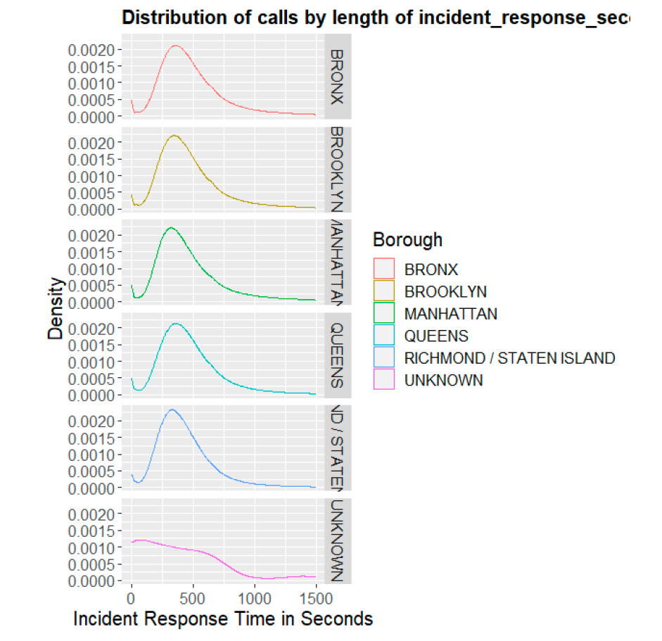

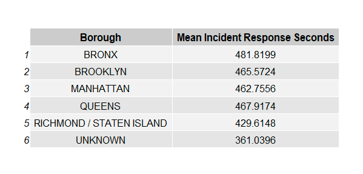

The above Distribution of calls by length of incident_response_seconds_qy, for each Borough shows that almost
all the boroughs have approximately same number calls by length of incident response time in seconds.
However, we can notice a slight difference in the distribution curve of Richmond/Saten Island borough as it is
slightly more left skewed than the rest of the boroughs.

5. Distribution of calls by length of incident_response_seconds_qy, for day of the week (i.e. seven
separate distributions)

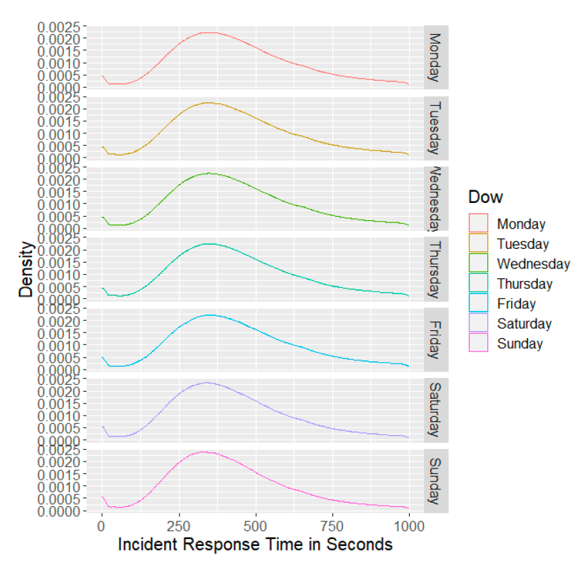

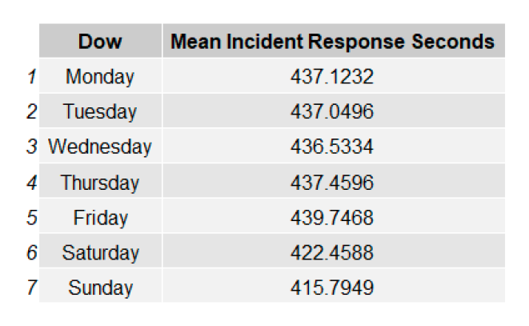

The above Distribution of calls by length of incident_response_seconds_qy, for day of the week, shows that
almost all the days of week have approximately same number calls by length of incident response time in
seconds. However, we can notice a slight difference in the distribution curve of Sunday as it is slightly more left
skewed than the rest of the days of the week.

6. Distribution of calls by length of incident_response_seconds_qy, for each month (i.e. 12 separate
distributions)

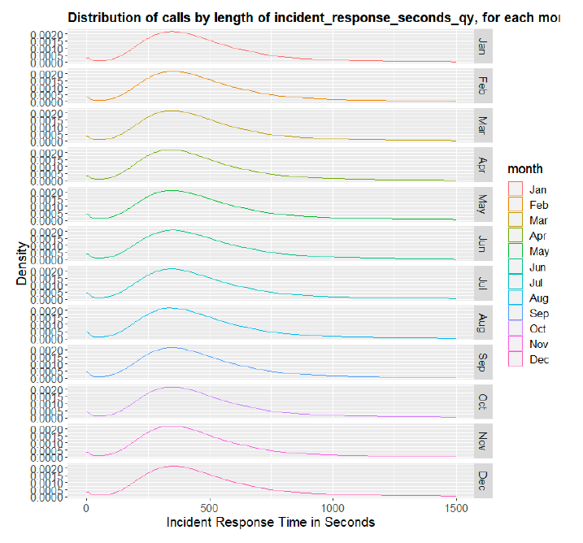

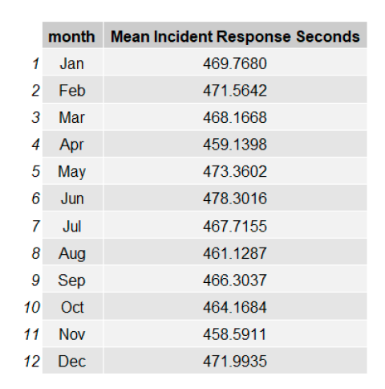

The above Distribution of calls by length of incident_response_seconds_qy, for each month, shows that almost
all the months have approximately the same distribution of calls by length of incident response time in seconds.

7. Distribution of calls by length of incident_travel_tm_seconds_qy, for each month (i.e. 12 separate
distributions)

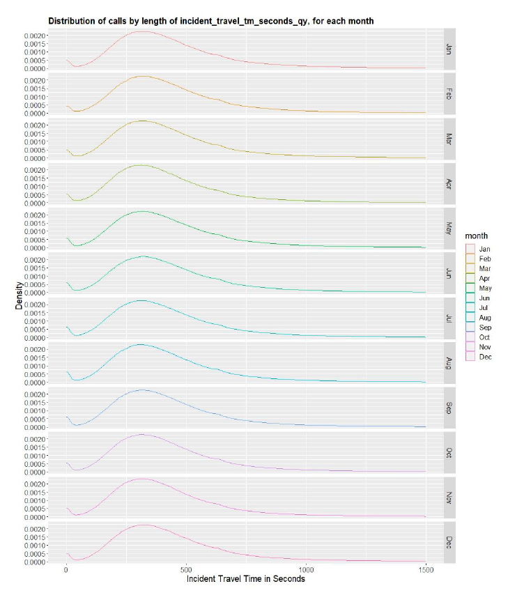

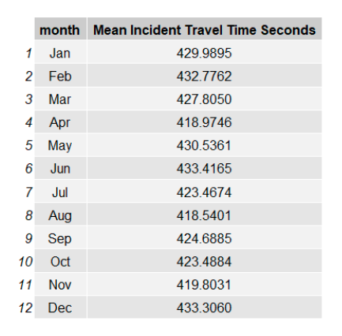

The above Distribution of calls by length of incident_travel_tm_seconds_qy, for each month, shows that almost
all the months have approximately the same distribution of calls by length of incident travel time in seconds.
Looking at the mean June and December have slightly higher Incident Travel Time in seconds than other months.

Part 3 – Additional Data Analysis on Weather data

1. Distribution of Average Daily Wind Speed for each month

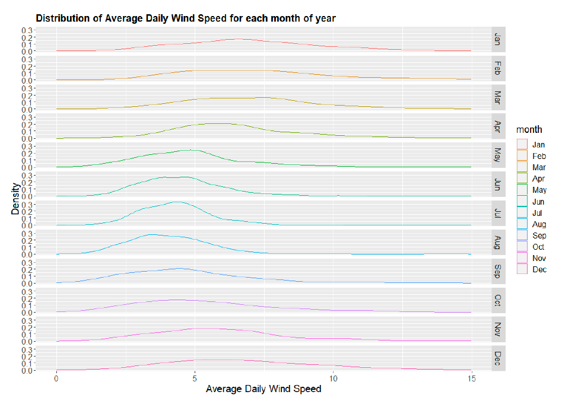

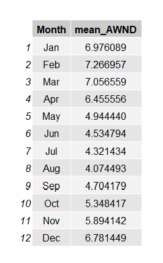

The above density curve shows the Distribution of Average Daily Wind Speed for each month of the year. We
can see that almost all the curves for all the months are left skewed. Especially, the months, May to August, are
highly left skewed, which means the mean is less than the median for these curves.

March is somewhat skewed right, but not a significant right. Almost all the curves are unimodal, which means
they only have one peak, and the highest peak is shown by the month of July.

2. Precipitation

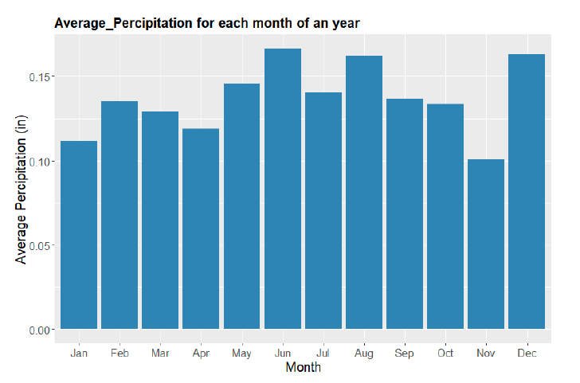

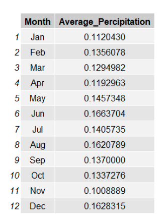

The above graph shows the average precipitation for each month of the year. June, on average for each year,
has the highest precipitation with 0.1663704. Followed by December and August with 0.1628315 and
0.1620789. There is an unusual drop in the average precipitation in November, which is the least precipitated
month among all.

3. Average Snowfall for each month

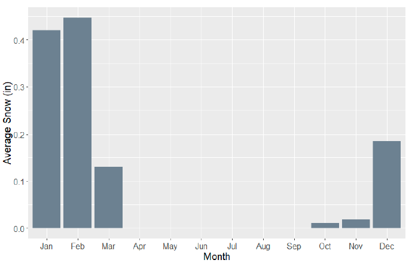

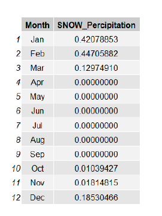

The above graph shows the average snowfall for each month of the year. As we know, winter slowly starts in
October. We can see a little snow in October and November, which shows the start of snowfall. The first heavy
snowfall began in December, which was 0.18530466 inches. We can also see the two February and January, the
two months with the highest average snowfall with 0.44705882 and 0.42078853 respectively. In March the
average snowfall starts to drop, that indicates the end of snow season.

4. Fog

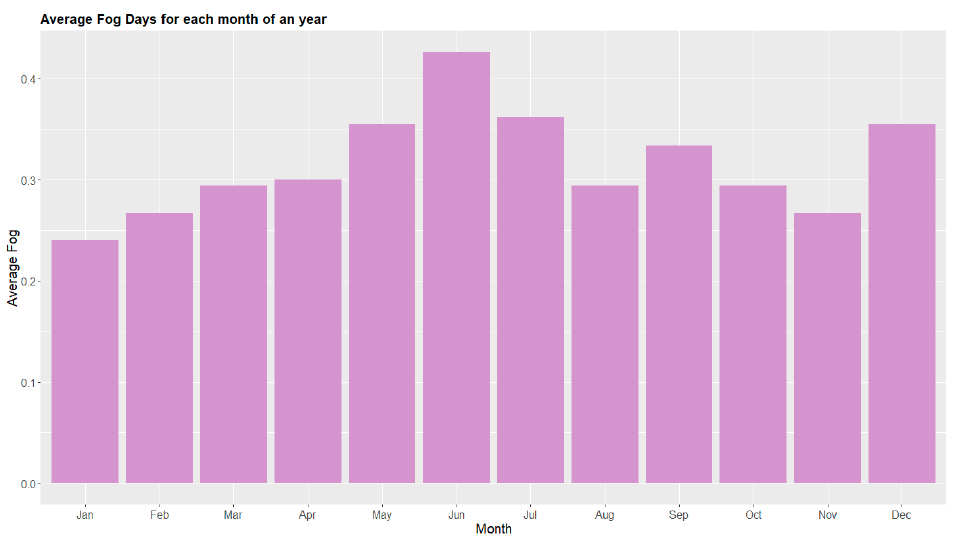

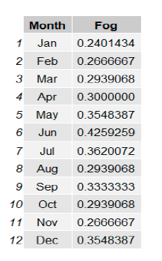

The above graph shows the Average fog days for each month of the year. We can see an increasing pattern of
average fog from January to June, with June being the month of the highest fog days with 0.4259259.

Additionally, a decreasing trend can be seen from June to August and then a sudden increase in the month of
September. Then, from September to November, there is a decrease in the average fog and finally a significant
increase in the month of December.

5. Ice Pallets

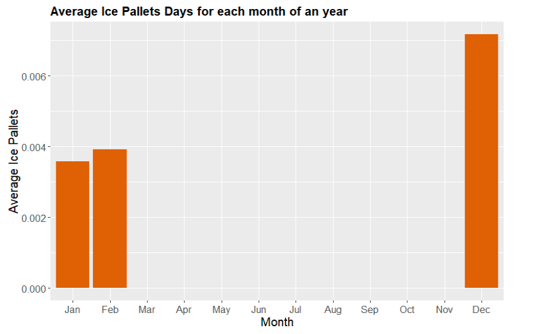

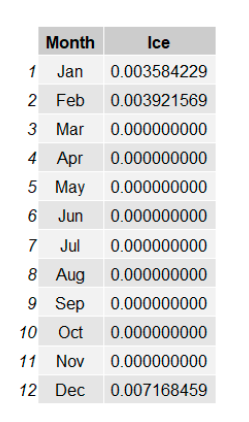

The above graph shows the Average Ice pellet days for each month of the year. We can clearly see that the ice
pellets are only visible in three months, with December being the highest ice pellets days month with
0.007168459. The months of January and February also show ice pellet days with 0.003584229 and
0.0039215669, however, these value of ice pellets is insignificant in front of December.

Discussion:

Unfavorable weather conditions can significantly affect how quickly an ambulance can get to its destination.
High wind speeds, heavy precipitation, snowfall, and fog or ice pellets can generate dangerous driving conditions
that could cause delays in ambulance response times.

Unfavorable weather might affect how accessible highways are. If roads aren't appropriately cleared after heavy
snowfall, they may become inaccessible, and ice particles can make them dangerously slick. Due to the necessity
for slower driving and more caution in such situations, ambulance response times may increase.

Ambulance drivers may encounter difficulties maneuvering safely due to fog and decreased visibility. Drivers
may experience delayed reaction times due to having to drive more cautiously to prevent collisions.

Emergency call volume can also be influenced by weather conditions. A larger call volume and lengthier
response times may result from increased accidents or health-related situations during severe weather.

To study the correlation between weather and response times, historical weather data and ambulance response
time data should be gathered. Finding patterns and correlations through data analysis and modeling can assist in
making informed decisions about how best to allocate resources.
